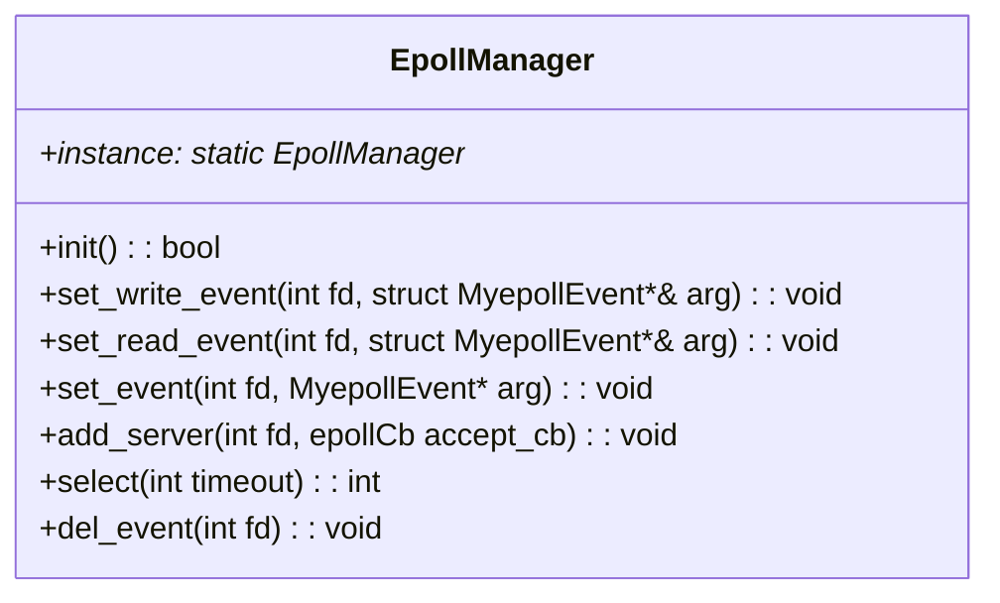

# epoll-frame

[English version](README_en.md)

`epoll-frame` 是一个使用 `epoll` I/O 模型进行网络通信的高性能服务器框架。此项目提供了可定制化的底层框架代码，可以根据需要自定义服务器逻辑。

特性
- 基于 epoll I/O 模型，具有卓越的性能表现
- 使用 C++11 语言风格编写，代码结构清晰易读
- 支持定时器管理和事件回调机制
- 提供详细的注释和文档，方便二次开发和应用

## 环境要求

- Linux 操作系统
- GCC 4.8 或更高版本
- CMake 3.0 或更高版本

## 项目文件说明
src文件目录下包含的是旧的C语言文件，基于C语言开发的程序内容。

源项目目录下的结果是基于C++11的代码，使用CMake进行构建，并且包含了一些示例代码和测试用例。

还有一个epoll的http服务器。这个项目的代码类似于[http-server: 一个简单的http服务器，支持静态网页内容，GET命令](https://github.com/doctordragon666/http-server)。底层用epoll实现，效率更高，也充分结合了这两点。

每个文件的开头都有详细的说明

```shell
.
├── CMakeLists.txt # CMake构建文件
├── Client.cpp # 客户端程序
├── EpollManager.cpp # epoll框架实现
├── EpollManager.h # epoll框架的封装
├── LICENSE
├── Network.h # 网络相关函数的封装
├── README.md
├── epoll_http.cpp # 一个使用network的http程序
├── global.h # 全局函数定义
├── main.cpp
├── src
│   ├── Makefile
│   ├── comm.c
│   ├── comm_epoll.c
│   ├── epollhttp
│   ├── globals.h
│   └── main_epoll.c
└── welcome.html # 使用的一个页面
```

下面给出关键程序的类图




## 应用示例
在linux环境下，使用CMake进行构建，并运行示例程序。
```bash
mkdir build
cd build
cmake ..
make
```

根据具体你要运行的程序选择，这是http服务器运行的结果

```shell
Server from: 127.0.0.1 :  80(IP : port), Serverfd = 3 
get a new client:127.0.0.1:42956
------------
receive from client:GET / HTTP/1.1
Host: localhost
Connection: keep-alive
sec-ch-ua: "Microsoft Edge";v="131", "Chromium";v="131", "Not_A Brand";v="24"
sec-ch-ua-mobile: ?0
sec-ch-ua-platform: "Windows"
Upgrade-Insecure-Requests: 1
User-Agent: Mozilla/5.0 (Windows NT 10.0; Win64; x64) AppleWebKit/537.36 (KHTML, like Gecko) Chrome/131.0.0.0 Safari/537.36 Edg/131.0.0.0
Accept: text/html,application/xhtml+xml,application/xml;q=0.9,image/avif,image/webp,image/apng,*/*;q=0.8,application/signed-exchange;v=b3;q=0.7
Sec-Fetch-Site: none
Sec-Fetch-Mode: navigate
Sec-Fetch-User: ?1
Sec-Fetch-Dest: document
Accept-Encoding: gzip, deflate, br, zstd
Accept-Language: zh-CN,zh;q=0.9,en;q=0.8,en-GB;q=0.7,en-US;q=0.6


------------
------------
get a new client:127.0.0.1:42970
------------
client: 5 close
------------
get a new client:127.0.0.1:42986
------------
receive from client:GET /favicon.ico HTTP/1.1
Host: localhost
Connection: keep-alive
sec-ch-ua-platform: "Windows"
User-Agent: Mozilla/5.0 (Windows NT 10.0; Win64; x64) AppleWebKit/537.36 (KHTML, like Gecko) Chrome/131.0.0.0 Safari/537.36 Edg/131.0.0.0
sec-ch-ua: "Microsoft Edge";v="131", "Chromium";v="131", "Not_A Brand";v="24"
sec-ch-ua-mobile: ?0
Accept: image/avif,image/webp,image/apng,image/svg+xml,image/*,*/*;q=0.8
Sec-Fetch-Site: same-origin
Sec-Fetch-Mode: no-cors
Sec-Fetch-Dest: image
Referer: http://localhost/
Accept-Encoding: gzip, deflate, br, zstd
Accept-Language: zh-CN,zh;q=0.9,en;q=0.8,en-GB;q=0.7,en-US;q=0.6


------------
------------
client: 6 close
------------
receive from client:POST /commit HTTP/1.1
Host: localhost
Connection: keep-alive
Content-Length: 22
Cache-Control: max-age=0
sec-ch-ua: "Microsoft Edge";v="131", "Chromium";v="131", "Not_A Brand";v="24"
sec-ch-ua-mobile: ?0
sec-ch-ua-platform: "Windows"
Origin: http://localhost
Content-Type: application/x-www-form-urlencoded
Upgrade-Insecure-Requests: 1
User-Agent: Mozilla/5.0 (Windows NT 10.0; Win64; x64) AppleWebKit/537.36 (KHTML, like Gecko) Chrome/131.0.0.0 Safari/537.36 Edg/131.0.0.0
Accept: text/html,application/xhtml+xml,application/xml;q=0.9,image/avif,image/webp,image/apng,*/*;q=0.8,application/signed-exchange;v=b3;q=0.7
Sec-Fetch-Site: same-origin
Sec-Fetch-Mode: navigate
Sec-Fetch-User: ?1
Sec-Fetch-Dest: document
Referer: http://localhost/
Accept-Encoding: gzip, deflate, br, zstd
Accept-Language: zh-CN,zh;q=0.9,en;q=0.8,en-GB;q=0.7,en-US;q=0.6

name=6565656&age=56565
---Post----
post commit --------
------------
------------
client: 5 close
------------
get a new client:127.0.0.1:42992
------------
receive from client:GET /favicon.ico HTTP/1.1
Host: localhost
Connection: keep-alive
sec-ch-ua-platform: "Windows"
User-Agent: Mozilla/5.0 (Windows NT 10.0; Win64; x64) AppleWebKit/537.36 (KHTML, like Gecko) Chrome/131.0.0.0 Safari/537.36 Edg/131.0.0.0
sec-ch-ua: "Microsoft Edge";v="131", "Chromium";v="131", "Not_A Brand";v="24"
sec-ch-ua-mobile: ?0
Accept: image/avif,image/webp,image/apng,image/svg+xml,image/*,*/*;q=0.8
Sec-Fetch-Site: same-origin
Sec-Fetch-Mode: no-cors
Sec-Fetch-Dest: image
Referer: http://localhost/commit
Accept-Encoding: gzip, deflate, br, zstd
Accept-Language: zh-CN,zh;q=0.9,en;q=0.8,en-GB;q=0.7,en-US;q=0.6


------------
------------
client: 5 close
------------
```

## 许可证

`epoll-frame` 项目采用 MIT 许可证。有关详细信息，请查看项目中的 LICENSE 文件。

## 参考

如果您在使用过程中遇到任何问题，欢迎联系开发者 [@doctordragon666](https://github.com/doctordragon666)。

感谢您对 `epoll-frame` 框架的支持和使用！
